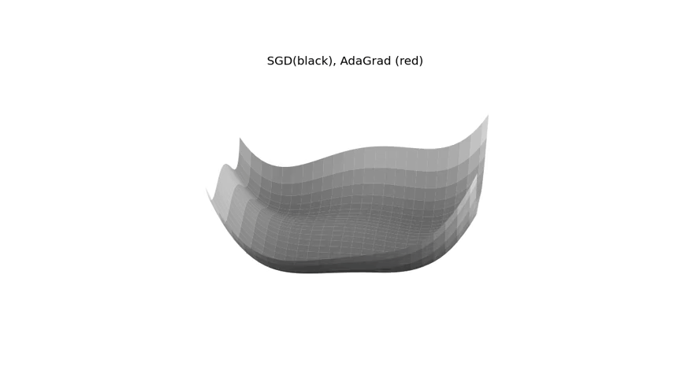
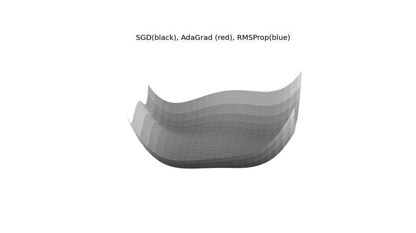
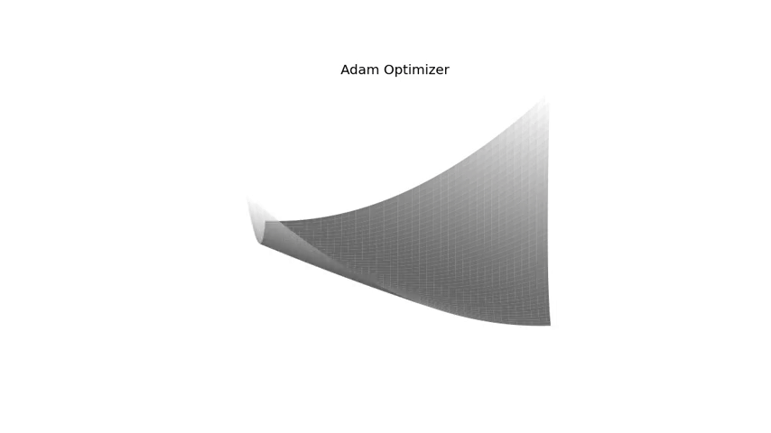

# Visualizing Neural Network Optimizers

In practice, tuning a neural network might be an art rather than a science. Having a strong intuition about algorithms are helpful for hacking and quick prototyping. For me, the most useful tools for grasping good intuition are visualizations and analogies.  

The Deep Learning book has a comprehensive chapter on optimizers. I am currently reading it and practicing them by implementing them into code. I am sharing my visualizations here so that it might be helpful for other learners.  

Optimizers are how we are updating the parameters. The objective is finding a set of $\theta$ values so that $J(\theta)$ is significantly lower. Starting with a relatively simple one:  

## Basic Optimization Algorithms

### Stochastic Gradient Descent

The most critical parameter is the learning rate. The higher the learning rate is, the higher the step size taken. Below is the update steps with a fixed learning rate:  

One way of making the learning faster is Decaying the Learning Rate:  

**Implementation:**

- The learning rate is decayed until the iteration $\tau$.  

- The learning rate on the iteration $k$ calculated as $ \epsilon_k = (1-\alpha)\epsilon_0+\alpha \epsilon_{\tau}$ where $\alpha = \frac{k}{\tau}$  

- The learning rate after the iteration $\tau$ is kept constant.  
- $\epsilon_{\tau}$ is generally set to 1 % of the initial learning rate ($\epsilon_0$).  

Below animation is the update steps with a decaying learning rate.  The initial learning rate is set to a higher value than the one in the previous example, but it is decayed after the 10. iteration.  

  

### Momentum

Momentum is one technique for accelerating the learning.  

Momentum requires a new hyperparameter: $\alpha$. It controls the acceleration. It is a common practice to pick 0.9, 0.95 and 0.99. It doesn't have to be a fixed value but can be adapted in the training process.  

**Implementation:**

- $\epsilon$ is the learning rate
- $\alpha$ is the hyperparameter for the acceleration,
- $\theta$ and velocity $v$  are the initial parameters. $v$ is initially set to 0.  
- Compute gradients and set it to $g$.  
- Compute velocity update as $v ← \alpha v − \epsilon g$
- Apply update: $\theta ← \theta + v$

Here is an animation in a 3D surface:

  

The problem of oscillations:  
Applying momentum can result in too much oscillations. As you can see in the above illustrations, there many U turns and spirals around a local/global minimum points. Nesterov Momentum is reducing those oscillations.  

### Nesterov Momentum

The difference between the standard Momentum and the Nesterov momentum algorithms is _where_ the gradients are calculated.  
In the Nesterov Momentum, gradients are evaluated after the current velocity is applied.  

**Implementation:**

- $\epsilon$ is the learning rate
- $\alpha$ is the hyperparameter for the acceleration,
- $\theta$ and velocity $v$  are the initial parameters. $v$ is initially set to 0.  
- Apply and interim update $\tilde{\theta} ← \theta + \alpha v$
- Compute gradients (at interim point) with parameter $\tilde{\theta}$ and set it to $g$.
- Compute velocity update as $v ← \alpha v − \epsilon g$
- Apply update: $\theta ← \theta + v$

Below is a visualization of the Momentum (black) vs Nesterov Momentum (red).  
The Nesterov Momentum is not oscilating much comparing to the standard Momentum algorithm. 

  

## Optimizers with Adaptive Learning Rates

### AdaGrad

AdaGrad is going from a shortest path. Here is the illusration:  
  

### RMSProp

  

### Adam

  