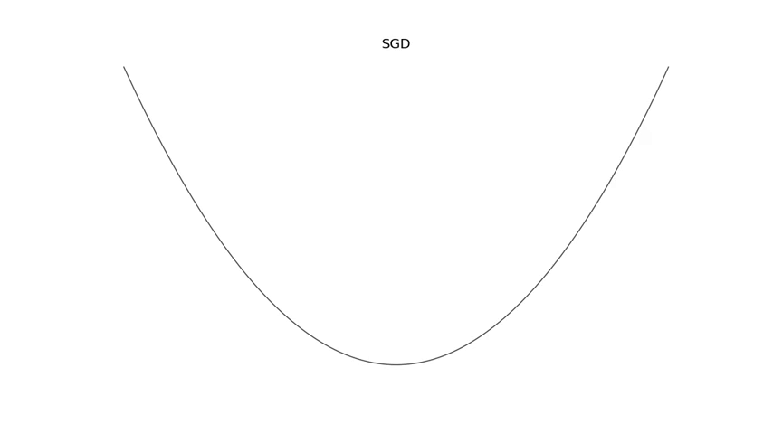

# Visualizing Neural Network Optimizers

In practice, tuning a neural network might be an art rather than a science. Having a strong intuition about algorithms are helpful for hacking and quick prototyping. For me, the most useful tools for grasping good intuition are visualizations and analogies.  

The Deep Learning book has a comprehensive chapter on optimizers. I am currently reading it and practicing them by implementing them into code. I am sharing my visualizations here so that it might be helpful for other learners.  

Optimizers are how we are updating the parameters. The objective is finding a set of $\theta$ values so that $J(\theta)$ is significantly lower. Starting with a relatively simple one:  

## Stochastic Gradient Descent

The most important parameter is the learning rate. The higher the learning rate is, the higher the step size taken. This is the update steps with a fixed learning rate:  

### Learning Rate Decay
Another practical technique is adjusting the learning rate.  

#### Implementation:

Decay the learning rate until the iteration $\tau$.  

$$ \epsilon_k = (1-\alpha)\epsilon_0+\alpha \epsilon_{\tau}$$
where $\alpha = \frac{k}{\tau}$

