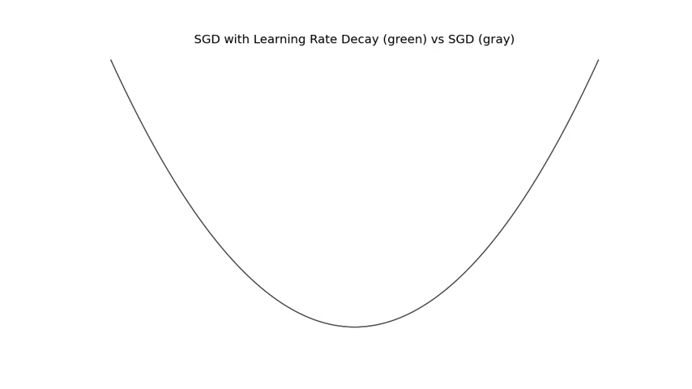
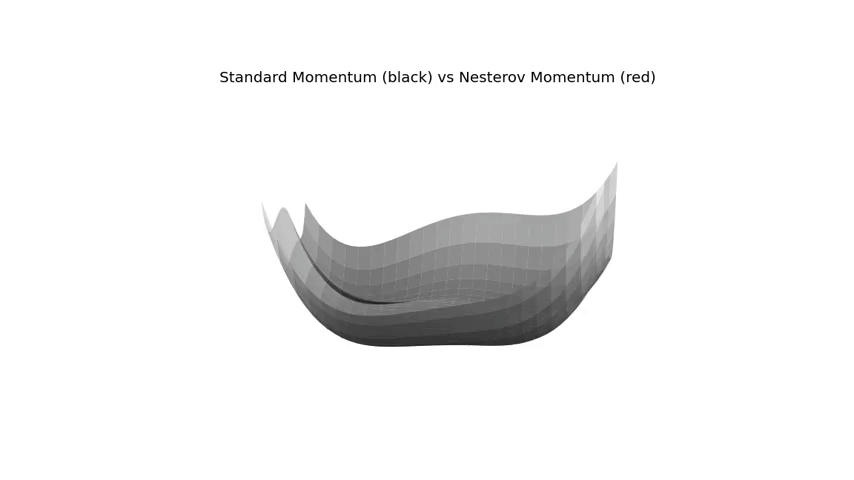

# Visualizing Neural Network Optimizers  

Having a strong intuition about algorithms are helpful for hacking and quick prototyping. For me, the most useful tools for grasping good intuition are visualizations and analogies.  

[The Deep Learning book](https://www.deeplearningbook.org/) has [a comprehensive chapter](https://www.deeplearningbook.org/contents/optimization.html) on optimizers. I am currently reading it and practicing them by implementing them into code. I am sharing my visualizations here so that it might be helpful for other learners.  

## Basic Optimization Algorithms  

What is an optimizer? It is how we are updating the parameters. The objective is finding a set of $\theta$ values so that $J(\theta)$ is significantly lower. Starting with a relatively simple one:  

### Stochastic Gradient Descent  

The most critical parameter is the learning rate. The higher the learning rate is, the higher the step size taken.  

**Implementation:**  

- $\theta$ is the parameter to learn.  
- $\epsilon$ is the learning rate. a hyperparameter.  

do iteratively:  
1. Compute gradients and set it to $g$.  
3. Apply update: $\theta \leftarrow \theta - \epsilon g$  

Below is the update steps with a fixed learning rate:  

  

One way of making the learning faster is Decaying the Learning Rate:  

**Implementation:**  

- The learning rate is decayed until the iteration $\tau$.  

- The learning rate on the iteration $k$ calculated as $\epsilon_k=(1-\alpha)\epsilon_0+\alpha \epsilon_{\tau}$ where $\alpha = \frac{k}{\tau}$  

- The learning rate after the iteration $\tau$ is kept constant.  
- $\epsilon_{\tau}$ is generally set to 1 % of the initial learning rate ($\epsilon_0$).  

Below animation is the update steps with a decaying learning rate applied.  The initial learning rate is set to a higher value than the one in the previous example, but it is decayed after some iteration.  

  

### Momentum  

Momentum is one technique for accelerating learning.  

Momentum requires a new hyperparameter: $\alpha$ which controls the acceleration. It is a common practice to pick a value of 0.9, 0.95, or 0.99. It doesn't have to be a fixed value but can be adapted in the training process.  

**Implementation:**  

- $\theta$ is the parameter to learn.  
- $\epsilon$ is the learning rate. a hyperparameter.  
- $\alpha$ controls the 
ration. a hyperparameter.  
- $v$ is the velocity and it is initially set to 0. a hyperparameter.  

do iteratively:  
1. Compute gradients and set it to $g$.  
2. Compute velocity update as $v \leftarrow \alpha v − \epsilon g$  
3. Apply update: $\theta \leftarrow \theta + v$  

Here is an animation in a 3D surface:  

  

The problem of oscillations:  
Applying momentum can result in too 

oscillations. As you can see in the above illustrations, there many U-turns and spirals around local/global minimum points. Nesterov Momentum is reducing those oscillations.  

### Nesterov Momentum  

The difference between the standard Momentum and the Nesterov momentum algorithms is _where_ the gradients are calculated.  
In the Nesterov Momentum, gradients are evaluated after the current velocity is applied.  

**Implementation:**  

- $\theta$ is the parameter to learn.  
- $\epsilon$ is the learning rate. a hyperparameter.  
- $\alpha$ controls the acceleration. a hyperparameter.  
- $v$ is the velocity and it is initially set to 0. a hyperparameter.  

do iteratively:  
1. Apply and interim update $\tilde{\theta} \leftarrow \theta + \alpha v$  
2. Compute gradients (at interim point) with parameter $\tilde{\theta}$ and set it to $g$.  
3. Compute velocity update as $v \leftarrow \alpha v − \epsilon g$  
4. Apply update: $\theta \leftarrow \theta + v$  

Below is a visualization of the standard momentum (black) vs Nesterov momentum (red).  
The Nesterov Momentum is not oscilating much comparing to the standard Momentum algorithm.  

  

## Optimizers with Adaptive Learning Rates  

### AdaGrad  

It is simple. We keep putting on the breaks on the descending hills, and we don't put too many on the plateaus.  

Technically speaking:  

- A small decrease in the learning rate when the partial derivative is small.  
- A rapid decrease in the learning rate when the partial derivative is large.  

One issue:  
The accumulation of the gradients _from the beginning_ is resulting in an excessive decrease in the learning rate.  
It works fine in a convex function, but it might be stuck in local minimums in non-convex settings.  
The next algorithm, RMSProp will handle this issue.  

**Implementation:**

- $\theta$ is the parameter to learn.  
- $\epsilon$ is the learning rate. a hyperparameter.  
- $\delta$ small constant for numerical stability (for avoiding division by zero). a hyperparameter.  
- $r$ gradient accumulation variable. Initially 0.  

do iteratively:  
1. Compute gradients and set it to $g$.  
2. Accumulate squared gradient: $r \leftarrow r + g \odot g$  
3. Compute update: $\Delta \boldsymbol{\theta} \leftarrow-\frac{\epsilon}{\delta+\sqrt{\boldsymbol{r}}} \odot \boldsymbol{g}$  
4. Apply Update: $\boldsymbol{\theta} \leftarrow \boldsymbol{\theta}+\Delta \boldsymbol{\theta}$  

### RMSProp

RMSProp is not taking the entire history but the recent ones. Here is a comparison of AdaGrad (gray) and RMSProp (red):  

**Implementation:**

- $\theta$ is the parameter to learn.  
- $\epsilon$ is the learning rate. a hyperparameter.  
- $\rho$ is the decay rate.  
- $\delta$ small constant for numerical stability (for avoiding division by zero). a hyperparameter.  
- $r$ gradient accumulation variable. Initially 0.  

do iteratively:  
1. Compute gradients and set it to $g$.  
2. Accumulate squared gradient: $r \leftarrow \rho r+(1-\rho) g \odot g$  
3. Compute parameter update: $\Delta \boldsymbol{\theta}=-\frac{\epsilon}{\sqrt{\delta+\boldsymbol{r}}} \odot \boldsymbol{g}$  
4. Apply Update: $\boldsymbol{\theta} \leftarrow \boldsymbol{\theta}+\Delta \boldsymbol{\theta}$  

  

### Adam  

And, finally Adam. More or less, it covers most of the ideas the previous algorithms have to offer. It is my default choice in training machine learning models.    

**Implementation:**  

- $\theta$ is the parameter to learn.  
- $\delta$ small constant for numerical stability (for avoiding division by zero). a hyperparameter.  
- $\epsilon$ is the learning rate. a hyperparameter.  
- $\rho1$ and $\rho1$ are the decay rates.  
- $s$ and $r$ are the first and the second variables. Initially both of them are 0.  

do iteratively:  
1. Compute gradients and set it to $g$.  
2. $t \leftarrow t+1$  
3. Update biased first moment estimate: $s \leftarrow \rho_{1} s+\left(1-\rho_{1}\right) \boldsymbol{g}$  
4. Update biased second moment estimate: $\boldsymbol{r} \leftarrow \rho_{2} \boldsymbol{r}+\left(1-\rho_{2}\right) \boldsymbol{g} \odot \boldsymbol{g}$  
5. Correct bias in first moment: $\hat{\boldsymbol{s}} \leftarrow \frac{\boldsymbol{s}}{1-\rho_{1}^{t}}$  
6. Correct bias in second moment: $\hat{\boldsymbol{r}} \leftarrow \frac{\boldsymbol{r}}{1-\rho_{2}^{t}}$  
7. Compute Update: $\Delta \boldsymbol{\theta}=-\epsilon \frac{\hat{\boldsymbol{s}}}{\sqrt{\hat{\boldsymbol{r}}}+\delta}$  
8. Apply Update: $\boldsymbol{\theta} \leftarrow \boldsymbol{\theta}+\Delta \boldsymbol{\theta}$  

Here is an animation. Moving like a snake:  

